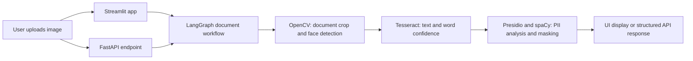

# SecureKiosk-AI

Privacy-focused identity-document processing with computer vision, OCR, and PII redaction.  # noqa: E999

[](https://www.python.org/)
[](https://securekiosk-ai-mj.streamlit.app/)
[](https://fastapi.tiangolo.com/)
[](https://langchain-ai.github.io/langgraph/)
[](https://docs.pydantic.dev/)
[](https://opencv.org/)
[](https://numpy.org/)
[](https://python-pillow.org/)
[](https://github.com/tesseract-ocr/tesseract)
[](https://microsoft.github.io/presidio/)
[](https://spacy.io/)
[](https://prometheus.io/)
[](https://www.docker.com/)
[](https://kubernetes.io/)
[](https://nginx.org/)
[](https://docs.pytest.org/)
[](https://docs.astral.sh/ruff/)
[](https://github.com/MalaikaJunaid/SecureKiosk-AI/actions)

[](https://dev.to/malaikajunaid/build-a-zero-trust-document-pipeline-with-opencv-presidio-and-langgraph-beginner-guide-1llm)

**[Open the live Streamlit application](https://securekiosk-ai-mj.streamlit.app/)**

## Overview

SecureKiosk-AI is a demonstration project for processing identity-document images such as ID cards and passports. It combines image cleanup, document and face detection, OCR, and PII masking in a reusable LangGraph workflow.

The project has two ways to run the workflow:

- **Streamlit interface (`app.py`)**: upload an image, preview it, run the pipeline, and inspect the redacted text and analysis.
- **FastAPI service (`src/api/main.py`)**: submit an image to `POST /api/v1/process` and receive structured CV, OCR, and privacy results. The API also exposes `/healthz` and Prometheus metrics at `/metrics`.

The pipeline runs on the server hosting the app or API. Although it masks detected PII in its results, the project is not a complete identity-verification product and does not claim regulatory compliance or secure data retention.

## Live app and tutorial

- **Live app:** [SecureKiosk-AI on Streamlit Community Cloud](https://securekiosk-ai-mj.streamlit.app/)
- **Beginner tutorial:** [Build a Zero-Trust Document Pipeline with OpenCV, Presidio, and LangGraph](https://dev.to/malaikajunaid/build-a-zero-trust-document-pipeline-with-opencv-presidio-and-langgraph-beginner-guide-1llm)

## System architecture



The Streamlit UI invokes the workflow directly in-process; it does not call the FastAPI service. The Docker image and Kubernetes manifests run the FastAPI service.

## How it works

1. **Upload:** The Streamlit UI accepts PNG and JPEG images. The API accepts uploaded image files at `POST /api/v1/process`.
2. **Decode and prepare:** The workflow decodes the image bytes with OpenCV. It searches for a large four-corner document contour and applies a perspective transform when found. If no document boundary is found, it continues with the original image.
3. **Detect face:** OpenCV's Haar cascade finds faces on the processed document; the largest detected face and its bounding box are recorded. Face detection is analysis metadata—the OCR step processes the document image, not just the face crop.
4. **Extract text:** The OCR component converts the document to grayscale, blurs and adaptively thresholds it, then uses Tesseract to extract word tokens, bounding boxes, and confidence scores.
5. **Mask PII:** Microsoft Presidio analyzes the extracted text using the configured English spaCy model. Detected entities are anonymized and counted by type.
6. **Return results:** LangGraph passes the results through the workflow, and the UI displays them. The API serializes them using its Pydantic response schema.

## Tech stack

| Area | Technologies | Purpose |
| --- | --- | --- |
| User interface | Streamlit, Pillow | Image upload, preview, processing controls, and result display |
| API | FastAPI, Uvicorn, Pydantic | HTTP upload endpoint, health check, and typed response |
| Workflow | LangGraph | Sequences CV, OCR, and privacy processing nodes |
| Computer vision | OpenCV, NumPy | Image decoding, document contour/perspective processing, and face detection |
| OCR | Tesseract, pytesseract | Text recognition and per-word confidence/bounding boxes |
| Privacy | Microsoft Presidio, spaCy | PII detection and anonymization |
| Monitoring | Prometheus FastAPI Instrumentator | API metrics endpoint |
| Packaging and deployment | Docker, Kubernetes, NGINX Ingress | Containerized API, service routing, and optional autoscaling |
| Quality | pytest, Ruff, GitHub Actions | Unit tests, linting, and CI |

## Installation and local setup

### Prerequisites

- Python 3.10 or newer
- Tesseract OCR installed and available on your system `PATH`
- Git
- Docker and Minikube only if you plan to use the container or local Kubernetes deployment

On Windows, install Tesseract and add its installation directory to `PATH`. If it is not on `PATH`, set `TESSERACT_CMD` in a local `.env` file to the full path of `tesseract.exe`.

### Install Python dependencies

```powershell
git clone https://github.com/MalaikaJunaid/SecureKiosk-AI.git
cd SecureKiosk-AI
python -m venv .venv
.\.venv\Scripts\Activate.ps1
python -m pip install --upgrade pip
pip install -r requirements.txt
```

### Run the Streamlit app

```powershell
streamlit run app.py
```

### Run the FastAPI service

```powershell
uvicorn src.api.main:app --reload
```

The API is available at `http://127.0.0.1:8000`. Its interactive OpenAPI page is at `http://127.0.0.1:8000/docs`.

### Try the sample API request

With the API running, use the included smoke-test script:

```powershell
python test_pipeline.py
```

It submits `samples/img_dl.png` to the local API and prints a short summary of the response.

## Deployment

### Streamlit Community Cloud

The interactive app is deployed on [Streamlit Community Cloud](https://securekiosk-ai-mj.streamlit.app/). To create or update a Community Cloud deployment, connect the GitHub repository, select `app.py` as the main file, and deploy. The repository's `requirements.txt` provides Python dependencies and `packages.txt` lists the required system packages.

### Docker (FastAPI)

The Dockerfile builds and runs the FastAPI service, not the Streamlit interface.

```powershell
docker build -t securekiosk-ai:latest .
docker run --rm -p 8000:8000 securekiosk-ai:latest
```

Check `http://localhost:8000/healthz` for the service health response.

### Kubernetes

The manifests in `k8s/` deploy the API and include a `LoadBalancer` Service, an optional Horizontal Pod Autoscaler, and an NGINX Ingress rule. For a local Minikube cluster:

```powershell
minikube start
docker build -t securekiosk-ai:latest .
minikube image load securekiosk-ai:latest
kubectl apply -f k8s/deployment.yaml
kubectl apply -f k8s/hpa.yaml
kubectl apply -f k8s/ingress.yaml
kubectl get deployments,pods,services,hpa,ingress
```

The HPA manifest is configured for 1 to 5 replicas at a target average CPU utilization of 70%. CPU-based scaling also requires a cluster metrics provider and a CPU request on the workload. The Ingress rule uses the host `securekiosk.local`, so configure an ingress controller and map that hostname to the cluster's ingress address before testing it. The ingress backend targets Service port `80`, which forwards traffic to container port `8000`.

## Key features

- Interactive upload-and-process UI with an original-image preview.
- Document boundary detection and perspective correction, with a full-image fallback.
- Face detection with a displayed bounding box when a face is found.
- OCR output containing extracted words, confidence scores, and word coordinates.
- PII masking with entity-type counts.
- FastAPI endpoint with structured results, health check, and Prometheus metrics.
- Docker and Kubernetes configuration for running the API service.

## Project structure

```text
SecureKiosk-AI/
├── .github/
│   └── workflows/
│       └── main.yml          # CI: Ruff, pytest, Docker image build
├── k8s/
│   ├── deployment.yaml       # API Deployment and Service
│   ├── hpa.yaml              # CPU-based autoscaling
│   └── ingress.yaml          # NGINX ingress routing
├── samples/                  # Example document images
├── src/
│   ├── api/
│   │   └── main.py           # FastAPI endpoints
│   ├── cv/
│   │   └── processor.py      # Document and face image processing
│   ├── ocr/
│   │   └── extractor.py      # OCR preprocessing and extraction
│   ├── privacy/
│   │   └── redactor.py       # PII detection and anonymization
│   ├── schemas/               # Pydantic result models
│   └── graph.py               # LangGraph workflow
├── tests/                     # CV, OCR, and privacy unit tests
├── app.py                     # Streamlit UI
├── Dockerfile                 # FastAPI container image
├── packages.txt               # System packages for Streamlit Cloud
├── requirements.txt           # Python dependencies
└── test_pipeline.py           # Local API smoke test
```

## Testing and code quality

Install the project dependencies, including Tesseract and the configured spaCy model, then run:

```powershell
pytest tests/
ruff check . --select E,F --ignore E501
```

The unit tests cover image processing, OCR extraction, and PII redaction. `test_pipeline.py` is a manual end-to-end API smoke test and requires the API server to be running.

GitHub Actions runs linting and the unit tests on pushes and pull requests to `main` and `master`, then builds the Docker image without publishing it.

## Contributing and areas for expansion

Contributions are welcome. Open an issue to discuss larger changes, then submit a pull request with focused changes and relevant tests.

- [ ] Add API integration tests for upload validation and response schemas.
- [ ] Improve document-type classification and OCR support for additional languages.
- [ ] Add explicit confidence thresholds and user review for uncertain results.
- [ ] Add more robust image-quality checks and failure messages.
- [ ] Add authentication, upload limits, and rate limiting for public API deployments.
- [ ] Add deployment examples for a managed Kubernetes cluster and production secrets/configuration.
- [ ] Expand observability with structured logs and processing metrics.
- [ ] Document data retention and privacy controls for each hosting environment.

## Legal disclaimer

This project is provided for educational and demonstration purposes. It is not legal, identity, or compliance advice, and it is not a substitute for a professionally audited identity-verification system. OCR and PII detection can be incomplete or inaccurate; review results before relying on them.

Uploads are processed by the server hosting the Streamlit app or API. Do not submit real identity documents or other sensitive personal information unless you have verified the deployment's security, access controls, and data-handling policies and have permission to do so. No guarantee is made that sensitive data will be retained, transmitted, or processed in a way that satisfies any particular legal or regulatory requirement.

## License

This project is open-source. Please refer to the [LICENSE](LICENSE) file for details.

## Author

**Malaika Junaid**  AI Engineer specializing in computer vision, NLP, and agentic workflows. Passionate about designing privacy-first, edge-deployable intelligence systems that bridge applied machine learning with production infrastructure.

## Last updated

October, 2026
